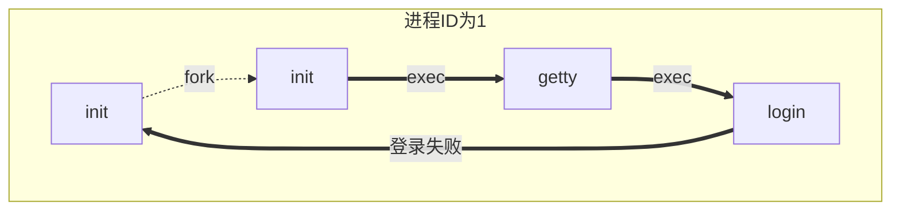
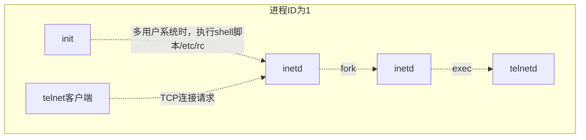

# 进程关系

> 这里记录的是进程组以及`POSIX.1`引入的会话的概念。还介绍登录shell和所有从登录shell启动的进程之间的关系。
>

## 终端登录

### BSD终端登录

* 系统管理者创建通常名为`/etc/ttys`的文件，其中，每个终端设备都有一行，每一行说明设备名和传到`getty`程序的参数。
* 当系统自举时，内核创建进程ID为1的进程，也就是`init`进程。`init`进程使系统进入多用户模式。
  * `init`进程读取`/etc/ttys`文件，对每一个允许登录的终端设备，`init`调用一次`fork`，它所生成的子进程则执行`exec getty`
* `getty`对终端设备调用`open`函数，以**读写方式**将终端打开。一旦终端打开，则文件描述符0、1、2就被设置到该设备
* 当用户键入用户名后，`getty`的工作就完成了。然后它会调用`login`程序。
* `login`程序可以做很多事情。因为它得到了用户名，所以可以调用`getpwnam`取得想用的用户口令登录项，然后可以验证登录口令。
* 当`login`程序验证口令失败时，父进程`init`获取到子进程的终止情况后，将再次调用`fork`，其后又执行了`getty`，对此终端重复上述过程

具体的流程见下图



* 因为最初的`init`进程具有超级用户特权，所有图中的所有进程都具有超级用户权限，而且他们的进程ID都是相同的，因为前面讲过，`exec`并不会改变进程ID

* 如果应用程序需要验证用户是否具有适当的权限去执行某个服务，那么我们要么将身份验证机制编写到引用中，要么使用PAM库得到同样的功能。
  * 使用PAM的优点是：管理员可以基于本地策略、针对不同任务配置不同的验证用户身份的方法
* `login`程序登录成功后，会完成如下工作：
  * 将当前工作目录更改为改用的起始目录(`chdir`)
  * 调用`chown`更改该终端的所有权，使登录用户成为它的所有者
  * 将对该终端设备的访问权限更改为`用户读写`
  * 调用`setgit`及`initgroups`设置进程的组ID
  * 用`login`得到的所有信息初始化环境：起始目录、shell、用户名以及一个系统默认路径(`PATH`)
  * `login`进程更改为登录用的用户ID并调用该用户的登录shell，调用方式类似于：
    * `execl("/bin/sh","-sh",(char *)0);`
    * 注意`argv[0]`的第一字符`-`是一个标志，表示该shell被作为登录shell调用
  * `login`做的工作还有很多，但是我们只需要学习上面这些就可以了
* 现在登录shell可以读取它的启动文件(bash是.bash_profile、C Shell是.cshrc和.login)
  * 这些启动文件通常更改某些环境变量并增加很多环境变量

### Mac OS终端登录

MacOS部分的基于FreeBSD，所有终端登录进程与BSD终端登录进程的工作步骤基本类似。但也有不同点。差异如下：

* `init`的工作由`launchd`完成
* 一开始提供的就是图形终端

### Linux终端登录

Linux的终端登录过程非常类似于BSD。他们之间的区别主要在于说明终端配置的方式

* 有些Linux发型版本使用了管理文件方式，在这些系统中，`/etc/inittab`包含配置信息
* 其他的Linux发型版本，使用存放在`/etc/init`目录下的`*.conf`命名的文件。例如运行`/dev/tty1`上的`getty`需要的说明可能放在`/etc/init/tty1.conf`文件中

## 网络登录

> 通过串行终端登录至系统和经由网络登陆至系统两者之间的主要(物理上)区别是：网络登录时，在终端和计算机之间的链接不再是点到点
>
> 在网络登录情况下，login仅仅是一种可用的服务，这与其他网络服务性质相同
>
> 正如上一小节终端登录所述，`init`知道哪些终端设备可以用来登录，并为每一个设备生成一个`getty`进程。但是网络登录情况不同，所有登录都经由内核的网络接口驱动程序，而且实现不知道将会有多少这样的登录。
>
> 因此必须等待一个网络连接请求的到达，而不是使一个进程等待每一个可能的登录
>
> 为了使同一个软件既能处理终端登录，又能处理网络登录，系统使用了一种被称为伪终端的软件驱动程序
>
> 它仿真串行终端的运行行为，并将终端操作映射为网络操作，反之亦然

### BSD网络登录

> 在BSD中，有一个`inetd`进程，它等待大多数网络连接。

* 作为系统启动的一部分，`init`调用一个shell，使其执行shell脚本`/etc/rc`。

* 由此shell脚本启动一个守护进程`inetd`
* 一旦此shell脚本终止，`inetd`的父进程就变成`init`
* `inetd`等待一个`TCP/IP`连接请求到达主机，当请求到达时，它会执行一次fork，然后生成的子进程`exec`适当的程序

下图以`telnet`服务程序为例演示



* 最后`telnetd`进程打开一个伪终端设备，并用`fork`分为两个进程。
  * 父进程处理通过网络连接的通信
  * 子进程则执行`login`程序。`login`执行的与上一节终端登录中讲述的一样
  * 父进程与子进程通过伪终端连接
* 需要理解的重点：当通过终端或网络登录时，我们得到一个登录shell，其标准输入、标准输出和标准错误要么连接到一个终端设备，要么连接到一个伪终端设备上

### Mac OS网路登录

Mac OS与BSD基本相同，只是`telnet`守护进程是从`launchd`运行的

### Linux网路登录

除了有些版本使用扩展的`xinetd`代替`inetd`进程外，基本与BSD相同

## 进程组

> 这一小节的概念比较多，要仔细牢记，避免在学习后面的知识点时产生混淆

* 每个进程除了一个进程ID外，还有一个进程组ID
* 进程组是一个或多个进程的集合
* **同一进程组中的各个进程接收来自同一终端的各种信号**
* 每个进程组有一个唯一的进程组ID
* 进程组ID类似于进程ID，它也是一个正整数，并且可以存放在`pid_t`数据类型中

### 获取进程组ID的函数

该函数只能获取调用进程的进程组ID

```c
#include <unistd.h>
pid_t getpgrp(void);
// 返回调用进程的进程组ID
```

### 获取指定进程的进程组ID的函数

```c
#include <unistd.h>
pid_t getpgid(pid_t pid);
//成功返回进程组ID，出错返回-1
```

* 若参数`pid`是0，则等于`getpgrp();`
* 每个进程组都有一个`组长进程`。**组长进程的进程组ID等于其进程ID**
* 进程组组长可以创建一个进程组、创建该组中的进程，然后终止
* 只要某个进程组中有一个进程存在，则该进程组就存在，与其组长进程是否终止无关
* 从进程组创建到其中最后一个进程离开为止的时间区间称为进程组的生命期
* 某个进程组中的最后一个进程可以终止，也可以转移到另一个进程组

### 加入一个现有进程组的函数

```c
#include <unistd.h>
int setpgid(pid_t pid,pid_t pgid);
```

* 两个参数相等时，则`pid`指向的进程变为进程组组长
* 如果`pid`是0，则使用调用者的进程ID
* 如果`pgid`是0，则由`pid`指定的进程ID作为进程组ID
* 一个进程只能为它自己或它的子进程设置进程组ID。在它的子进程调用了`exec`后，它就不再更改该子进程的进程组ID

## 会话

> **会话是一个或多个进程组的集合。通常是由Shell的管道将几个进程编到一组的。**

### 创建会话的函数

```c
#include <unistd.h>
pid_t setsid(void);
// 成功返回进程组ID，出错返回-1
```

**如果调用此函数的进程不是一个进程组的组长，则此函数创建一个新的会话**。具体会发生三件事：

1. 该进程变成新会话的会话首进程(创建该会话的进程)。此时该进程是新会话中的唯一进程
2. 该进程成为一个新进程组的组长进程。新进程组的ID等于该进程ID
3. 该进程没有控制终端。如果调用`setsid`之前该进程有一个控制终端，那么这种关系会被切断

如果调用进程是一个进程组的组长，则此函数出错返回。为防止这种错误，通常都是`fork`后，使父进程终止，子进程调用该函数。

### 获取会话ID的函数

```c
#include <unistd.h>
pid_t getsid(pid_t pid);
// 成功返回会话ID，出错返回-1
```

**会话ID就是会话首进程的进程组ID，会话首进程总是一个进程组的组长进程，所以：**

```c
					会话ID == 会话首进程的进程ID == 会话首进程的组ID
```

如果`pid`为0，`getsid`返回调用进程的会话ID。

该函数还有一个限制：如果`pid`不属于调用者所在的会话，那么调用进程就不能得到会话ID

## 控制终端

会话和进程组还有一些其他的特性：

* 一个会话可以有一个控制终端。通常是终端设备或者伪终端设备
* 建立与控制终端连接的会话首进程被称为控制进程
* 一个会话中的几个进程组可被分成一个前台进程组以及一个或多个后台进程组
* 如果一个会话有一个控制终端，则它有一个前台进程组，其他进程组为后台进程组
* 无论何时键入终端的中断键(一般是`Ctrl+C`或者`Delete`键)，都会将中断信号发送至**前端进程组**的所有进程
* 无论何时键入终端的退出键(常常是`Ctrl+\`)，都会将退出信号发送至**前台进程组**的所有进程
* 如果终端接口检测到调制解调器(或网络)已经断开连接，则将挂断信号发送至**控制进程**

```mermaid
graph BT;
	subgraph 会话
	subgraph 后台进程组,会话首进程 = 控制进程
		A[登录shell]
	end
	subgraph 后台进程组
		B[proc1]
		C[proc2]
	end
	subgraph 前台进程组
		E[proc3]
		F[proc4]
		G[proc5]
	end
	end
	H(控制终端)-->A
	H-->F
```

## `tcgetpgrp`、`tcsetpgrp`和`tcgetsid`函数

> 需要有一种方法来通知内核哪一个进程是前台进程组，这样，终端设备驱动程序就能知道将终端输入和终端产生的信号发送到何处

```c
#include <unistd.h>
pid_t tcgetpgrp(int fd);
// 成功返回前台进程组ID，出错返回-1
int  tcsetpgrp(int fd,pid_t pgrpid);
// 成功返回0，出错返回-1
```

* 函数`tcgetpgrp`返回前台进程组ID，它与在`fd`上打开的终端相关联

* 如果进程有一个控制终端，则该进程可以调用`tcsetpgrp`将前台进程组ID设置为`pgrpid`
  * `pgrpid`应当是在同一会话中的一个进程组的ID。
  * `fd`必须引用该会话的控制终端

大多数应用程序并不直接调用这两个函数。他们通常有作业控制shell调用

通过下面的函数，获得会话首进程的进程组ID

```c
#include <termios.h>
pid_t tcgetsid(int fd);
// 成功返回会话首进程的进程组ID，出错返回-1
```

## 作业控制

> 作业控制是BSD在1980年添加的一个特性
>
> 它允许在一个终端上启动多个作业(进程组)，它控制哪一个作业可以访问该终端以及那些作业在后台运行
>
> 作业控制需要有一下几个条件支持：
>
> * 支持作业控制的shell
> * 内核中的终端驱动程序必须支持作业控制
> * 内核必须提供对某些作业控制信号的支持
>
> 我们可以键入一个影响前台作业的特殊字符——挂期键(通常是`Ctrl+z`)，与终端驱动程序进行交互作用。键入次字符会使终端驱动程序将信号`SIGTSTP`发送至前台进程组中的所有进程，后台进程组作业则不受影响。
>
> 有三个特殊字符可以使终端驱动程序产生信号，并将它们发送至前台进程组
>
> 1. 中断字符(通常是`Ctrl+c`)产生`SIGINT`
> 2. 退出字符(通常是`Ctrl+\`)产生`SIGQUIT`
> 3. 挂起字符(通常是`Ctrl+z`)产生`SIGTSTP`
>
> 我们可以有一个前台作业和若干个后台作业，终端驱动程序必须处理这些作业中哪一个可以接收我们在终端上输入的字符，通常只有前台作业接收终端输入。
>
> 如果后台作业试图读中读终端，这并不是一个错误，但是终端驱动程序必须检测这种情况，并向后台作业发送一个特性的信号`SIGTTIN`。

## 孤儿进程

> 考虑这样的情况：
>
> 一个进程，它fork了一个子进程然后终止。父进程终止时，子进程停止(作业控制)又会如何？子进程如何继续，以及子进程是否知道自己已经是孤儿进程了。我们一步一步来讨论

* `fork`后让父进程睡眠5秒。为了让子进程先运行
* 子进程为挂断信号建立信号处理程序。
* 子进程调用`kill`函数给自身发送停止信号
* 当父进程终止时，该子进程成为孤儿进程
* 现在子进程是孤儿进程组的成员。孤儿进程组的定义为：该组中每个成员的父进程要么是该组的一个成员，要么不是该组所属会话的成员
* 父进程终止后，进程组包含一个停止的进程。`POSIX.1`要求向新孤儿组中处于停止状态的每一个进程发送挂断信号`SIGHUP`，接着向其发送继续信号`SIGCONT`
* 处理了挂断信号后，子进程继续
