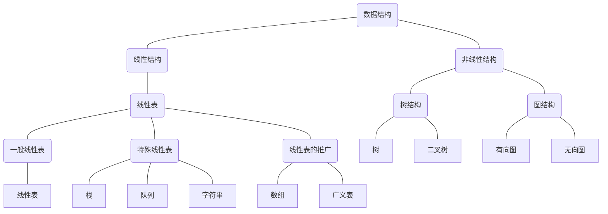

## 数据结构

数据结构是研究程序设计中计算机的操作对象以及它们之间的关系和操作的学科

## 基本概念
1. 数据：所有能输入到计算机，且能被计算机处理的符号的集合
2. 数据元素：是数据的**基本单位**，在计算机中通常作为一个整体进行考虑和处理，由若干**数据项**组成
3. 数据项：是组成数据元素的、有独立含义的、不可分割的**最小单位**
4. 数据对象：是性质相同的**数据元素的集合**
5. 数据结构：相互之间存在**一种或多种特定关系**的数据元素的集合
6. 结构：表示数据元素相互之间的关系
7. 数据结构的形式定义：$ Data\_Structure = (D,S) $. 
   1. D表示数据元素的有限集合
   2. S表示D上关系的有限集合
   3. 例如 $ Complex = (C,R) $
      1. C表示有两个实数的结合$ \{c_1,c_2\} $
      2. $ R=\{P\}$.P是定义在集合C上的一种关系$\{<c_1,c_2>\}$，c1表示复数的实部，c2表示负数的虚部

### 数据的逻辑结构

* 集合
* 线性结构
* 树形结构
* 图状结构

### 数据的存储结构

数据结构在计算机中的表示称为数据的物理存储结构，又称存储结构

在计算机中用来存储**数据元素**的存储单位称为**元素**或**结点**，数据元素中的若干数据项称为数据域

数据元素之间的关系在计算机中有两种表示方法：

* 顺序存储：以存储位置的相邻表示后继关系，例如：
  * 顺序表
* 链式存储：以附加信息表示后继关系，例如
  * 单链表
  * 循环链表
  * 双向链表
  * 二叉链表
  * 十字链表
  * 邻接表
  * 邻接多重表

### 数据类型
>数据类型是一个**值的集合**和定义在这个值集上的**一组操作**的总称
>
>类型明显或隐含地规定了在程序执行期间变量或表达式所有**可能取值的范围**，以及在这些值上**允许进行的操作**

数据类型可以分为两类：

1. 原子类型：不可以在分解的基本类型
2. 结构类型：有若干个类型组合而成，是可以再分解的

### 抽象数据类型

> 抽象数据类型是指一个**数学模型**以及定义在此数学模型上的**一组操作**。
>
> 抽象数据类型的定义**仅取决于它的一组逻辑特性**，而与其在计算机内部如何表示和实现无关，即不论其内部结构如何变化，只要它的数学特性不变，都不影响其外部的使用
>
> 数据抽象：强调的是它的本质特征以及可以使用的外部接口
> 数据封装：隐藏实现细节

一个含有抽象数据类型的软件模块通常包含**定义、表示和实现三个部分**组成。

* 定义：由一个**值域**和定义在该值域上的**一组操作**组成。按值的不同特性分为三类：
  * 原子类型：不可在分解
  * 固定聚合类型：其值由**确定数目**的成分按**某种结构**组成
  * 可变聚合类型：组成成分不确定

抽象数据类型的形式定义：$ (D,S,P) $.

* D是数据对象
* S是D上的关系集
* P是对D的基本操作集

### 多形数据类型

> 多形数据类型是指其值得成分不确定的数据类型

*注*：一个软件系统的框架应建立在数据之上，而不是建立在操作之上

## 算法和算法分析
> 算法是解决特定问题**求解步骤**的描述，在计算机中表现为指令的有限序列，并且每条指令表示一个或多个操作

### 算法的特征：
1. 有穷性：能够在有穷步后结束，且每一步都能在有穷时间能完成（还要合理）
2. 确定性：每种情况下都能得到合理的值
3. 可行性：每一步操作足够基本
4. 有输入：有零个或多个输入，取自某个特定的对象的集合
5. 有输出：有一个或多个输出，这些输出和输入有着某些特定关系的量

### 算法的设计原则
1. 正确性：满足规格和需求。一般有4个层次的差别
	1. 算法程序不能有语法错误
	2. 算法程序对于合法输入能够产生满足要求的输出
	4. 算法对故意刁难的测试输入都有满足要求的输出结果
	4. 算法程序对于所有的输入都能够产生满足规格的输出说明
	
	通常以第3层来衡量一个算法是否合格
2. 可读性：易于他人的理解
3. 健壮性：能够合理的处理非法数据
4. 算法的效率和低存储需求：执行时间尽可能短，所需存储空间尽可能的少

#### 算法的时间复杂度

统计算法的执行时间一般有两种方法：

1. 事后统计法：方法简单、直观，但是有两个缺陷：
   1. 必须依据算法编制的程序
   2. 所得到的时间的统计量依赖于计算机的硬件、软件等环境因素，有有时容易掩盖算法本身的优劣
2. 事前分析估算法：

影响算法执行时间的因素：

1. 算法选用的策略
2. 问题的规模
3. 编写程序的语言
4. 编译程序产生的机器代码的质量
5. 计算机执行指令的速度
   ....

主要关心的是：随着问题**规模n**的增长，算法**时间**f(n)的增长关系,记作: $T(n) = O(f(n))$

语句的频度：指该语句重复执行的次数

算法 = 控制结构 + 原操作(固有数据类型的操作)
所以算法执行的时间与原操作的执行次数成正比关系

##### 推导大O阶方法
1. 用常数1取代运行时间中的所有加法常数
2. 在修改后的运算次数函数中，只保留最高阶项
3. 如果最高阶项存在且系数不是1，则去除系数
4. 得到最后的结果就是大O阶

##### 常见的大O阶

常数阶：$O(1)$
线性阶：$O(n)$
平方阶：$O(n^2)$
对数阶：$O(log_xn)$
指数阶：$O(2^n)$

##### 两种测量方法一起使用

>例如，计算两个10 x 10的矩阵执行时间为12ms，则由算法的时间复杂度$ T(n) = O(n^3) $可以估算两个31 x 31的矩阵相乘所需是时间大致为$ (31 \div 10)^3 \times 12ms \approx 358ms $.

#### 算法的空间复杂度
算法的存储量包括：
1. 输入数据所占空间
2. 程序本身所占空间
3. 辅助变量所占空间

若输入数据所占空间只取决于问题本身，和算法无关，则只需分析出输入和程序之外的**辅助变量所占额外空间**

若所需额外空间相对于输入数据量来说是常数，则称算法为**原地工作**

随着问题规模n的增大，算法运行所需存储量的增长情况，记作：
$T(n) = O(g(n))$

