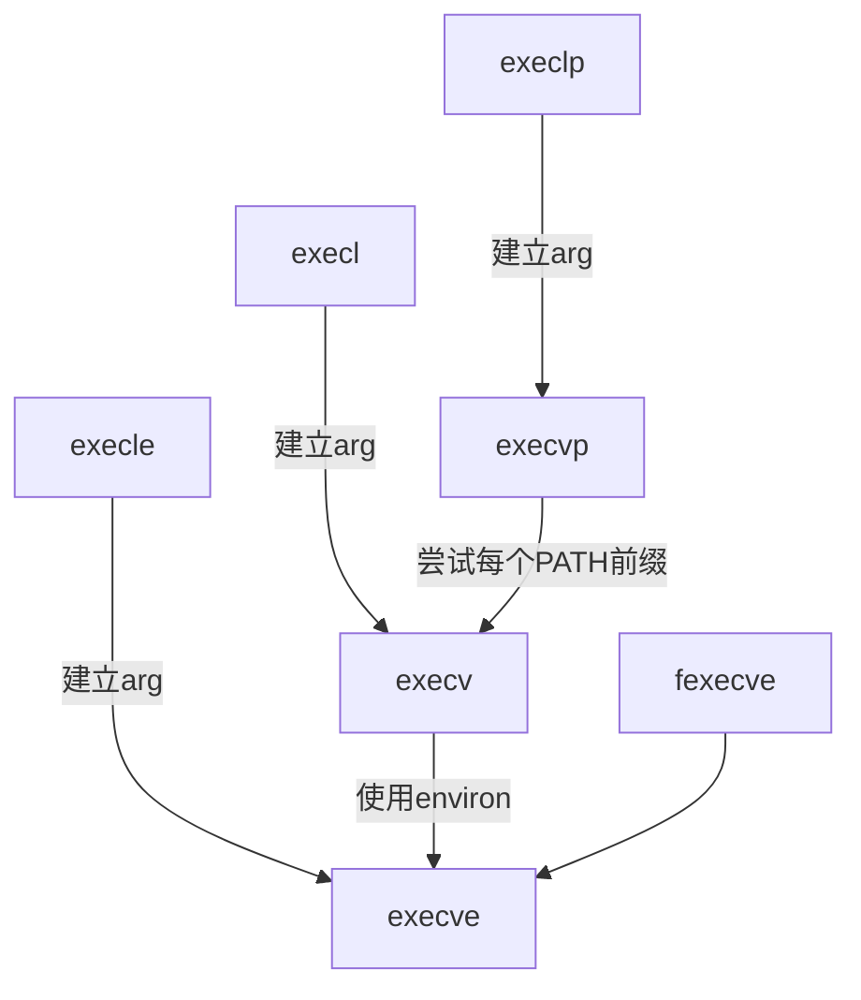
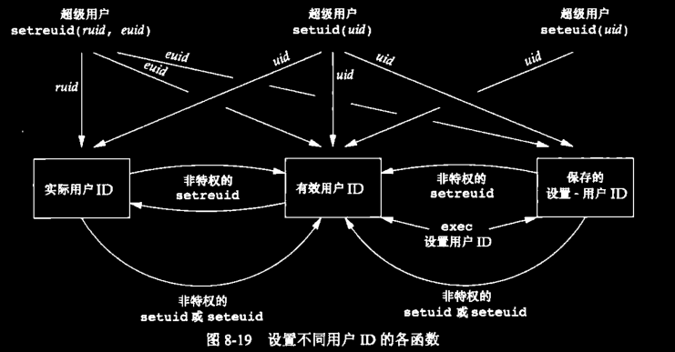

# 进程控制

这里记录在Unix系统中创建新进程、执行程序和进程终止相关的内容，说明进程的各种属性。
还记录了解释器文件和`system`函数，最后讲述一下大多数Unix系统所提供的进程会计机制。

<!-- more -->

# 进程标识

每个进程都有一个非负整型表示的唯一进程ID，虽然是唯一的，但是进程ID是可以复用的。
当一个进程终止后，大多数Unix系统实现延迟复用算法，使得赋予新进程的ID不同于最近终止进程所使用的ID。这防止了将新进程误认为是使用统一ID的某个已终止的先前进程。

系统中有一些专用进程，但是具体细节随实现而不同。大体的内容如下：

1. `ID = 0`的进程：交换进程(swapper)。属于内核的一部分，并不执行任何磁盘上的程序，也被称为系统进程
2. `ID = 1`的进程：`init`进程。
   * 在自举过程结束是有内核调用
   * 该进程的程序文件是`/sbin/init`
   * 它通常需要读取的初始文件为：`/etc/rc*`或`/etc/inittab`和在`/etc/init.d`中的文件
   * 它主要负责在自举内核后启动一个Unix系统，并将系统引导到一个状态，比如多用户状态
   * 该进程绝对不会终止
   * 该进程是一个用户进程，但是它以`root`用户执行
   * 该进程还是所有孤儿进程的父进程
3. `ID = 2`的进程：页守护进程(只在有些实现中)。负责支持虚拟存储器系统的分页操作

## 获取进程标识符的函数

```c
#include <unistd.h>

pid_t getpid(void);
// 返回调用进程的进程ID

pid_t getppid(void);
// 返回调用进程的父进程ID

uid_t getuid(void);
// 返回调用据称的实际用户ID

uid_t geteuid(void);
// 返回调用进程的有效用户ID

gid_t getgid(void);
// 返回调用进程的实际组ID

gid_t getegid(void);
// 返回调用进程的有效组ID
```

## 细节说明

**在这些函数中没有出错返回**

# fork函数

调用`fork`函数创建一个新的进程

## 函数定义

```c
#include <unistd.h>

pid_t fork(void);
// 子进程返回0，父进程返回子进程的ID。出错返回-1
```

## 函数说明

* `fork`函数调用一次，返回两次。
  * 子进程返回值为`0`的原因：一个进程只有一个父进程，所以子进程总是可以调用`getppid`以后的父进程的进程ID
  * 父进程有返回值的原因：一个进程的子进程可以有多个，并且没有一个函数使一个进程可以获得其所有子进程的进程ID
* 进程ID`0`总是由内核交换进程使用，所以一个子进程的进程ID不可能为`0`
* 子进程和父进程继续执行`fork`后的指令，子进程是父进程的副本。
  * 子进程获得父进程的数据空间、堆和栈的副本。
  * 子进程和父进程共享父进程的正文段。可以看上一篇文章中的进程模型
* 由于`fork`之后经常跟随这`exec`函数，所以很多实现使用写时复制技术。
* 父进程的数据段、堆和栈并不是立即创建副本，而是与子进程共享，且内核将它们的访问权限改为只读。
* 如果父进程和子进程中的任一个试图修改这些区域，则内核只为修改区域的那块内存制作一个副本，通常是内存中的一页
* 在`fork`后是父进程还是子进程先执行是确定的，这取决与内核所使用的调度算法
* 在`fork`之后两种处理文件描述符的情况：
  * 父进程等待子进程完成再操作
  * 父进程和子进程个字执行不同的程序段
* 子进程从父进程那里继承的属性有：
  * 打开的文件描述符
  * 实际用户ID、实际组ID、有效用户ID、有效组ID
  * 附属组ID、进程组ID
  * 会话ID
  * 控制终端
  * 设置用户ID标识和设置组ID标识
  * 当前工作目录
  * 根目录
  * 文件模式创建屏蔽字
  * 信号屏蔽和安排
  * 对任一打开文件描述符的执行时关闭(close-on-exec)标识
  * 环境
  * 连接的共享存储段
  * 存储映像
  * 资源限制
* 子进程和父进程之间的区别：
  * `fork`的返回值不同
  * 进程ID不同
  * 两个进程的父进程ID不同
  * 子进程的`tms_utime`、`tms_stime`、`tms_cutime`和`tms_ustime`的值设置为0
  * 子进程不继承父进程设置的文件锁
  * 子进程的未处理闹钟被清除
  * 子进程的未处理信号集设置为空集
* 导致`fork`失败的两种原因：
  * 系统中已经有太多的进程
  * 该实际用户ID的进程总数超过了系统限制(CHILD_MAX)
* `fork`的两个作用：
  * 一个父进程希望复制自己，是父进程和子进程同时执行不同的代码
  * 一个进程要执行一个不同的程序
    * 有些系统将`fork`和`exec`组合成一个操作，称为`spawn`。

## 额外知识点

* `sizeof`和`strlen`的区别：
  * `strlen`返回的长度不包含结束。且`strlen`是一个函数调用
  * `sizeof`返回的长度中包含结束符。对`sizeof`而言，因为缓冲区用已知字符串进行初始化，其长度是固定的，所以在编译时期计算缓冲区长度

# exit函数

在进程环境那边文章里说过了进程的5种正常终止和3种异常终止的方式。

不管进程如何终止，最后都会执行内核中的同一段代码，这段代码的作用是为相应的进程关闭所有打开的描述符，释放它所使用的存储器等等。

对于进程的8种终止方式，我们都希望它的父进程能够获取到它是如何终止的。三个终止函数`(exit,_exit,_Exit)`，实现这一点的方式是，将其退出状态作为参数传递给函数。异常状态下，内核会产生一个导致其异常终止原因的终止状态。在任何状态下，它的父进程都可以调用`wait`或者`waitpid`函数来获取它的状态信息

如果子进程还没有结束，而父进程已经结束时，那么子进程的父进程会变成`init`进程，也就是进程ID为1的进程。

在`UNIX`术语中，一个已经终止、但是其父进程尚未对其进行善后处理(获取终止子进程的有关信息、释放它仍占用的资源)的进程，被称为僵死进程

# wait和waitpid函数

当一个进程正常或异常终止时，内核就会向其父进程发送`SIGCHLD`信号。

父进程可以选择忽略信号，或是提供一个在信号发生被调用的处理函数。

对于`SIGCHLD`信号系统的默认动作是忽略它。

调用`wait`和`waitpid`的进程会有发生以下情况：

* 如果其所有子进程都还在运行，则调用进程阻塞
* 如果一个子进程已经终止，正等待父进程获取其终止状态，则取得该子进程的终止状态立即返回
* 如果它没有任何子进程，则立即出错返回

## 函数定义

```c
#include <sys/wait.h>

pid_t wait(int *statloc);
pid_t waitpid(pid_t pid, int *statloc, int options);
// 成功返回进程ID，出错返回0或-1
```

## 参数说明

`statloc`参数：

* 如果`statloc`不是空指针，则终止进程的终止状态就存放在它所指向的地址内
  * 进程正常退出时，某几位用来表示退出状态
  * 进程异常退出时，其他几位用来表示信号编号
  * 有一位指针是否产生了`core`文件等
  * 实现不同所以上面的描述中没有写指定的位数，但是可以使用系统提供的宏区别（见下表）。
* 如果不关心终止状态，可以将该参数置为空指针

|           宏           |                             说明                             |
| :--------------------: | :----------------------------------------------------------: |
|  `WIFEXITED(status)`   | 若进程正常终止则为真，可以使用`WEXITSTATUS(status)`获取子进程传给`exit`或`_exit`参数的低8位 |
| `WIFSIGNALED(status)`  | 若异常终止子进程返回的状态，则为真。可以执行`WTERMSIG(status)`，获取使子进程终止的信号编号。有些实现定义宏`WCOREDUMP(status)`，若产生core文件则返回真 |
|  `WIFSTOPPED(status)`  | 若为当前暂停子进程的返回的状态，则为真。可以执行`WSTOPSIG(status)`，获取是子进程暂停的信号 |
| `WIFCONTINUED(status)` | 若作业控制暂停后已经继续的子进程返回了状态，则为真。仅用于`waitpid` |

`waitpid`函数中`pid`参数的解释

* `pid` == -1  等待任一子进程，与wait函数功能相似
* `pid` > 0     等待进程ID与`pid`相同的子进程
* `pid` == 0   等待组ID等于调用进程组ID的任一子进程
* `pid` < -1    等待组ID相等于`pid`绝对值的任一子进程

`waitpid`函数的`options`参数(除了0以外)，决定`waitpid`的操作：

|     常量     |                             说明                             |
| :----------: | :----------------------------------------------------------: |
| `WCONTINUED` | 若实现支持作业控制，那么由`pid`指定的任一子进程在停止后已经继续，但其状态尚未报告，则返回其状态 |
|  `WNOHANG`   | 若由`pid`指定的子进程并不是立即可用的，则`waitpid`不阻塞，此时返回值为0 |
| `WUNTRACED`  | 若实现支持作业控制，而`pid`指定的任一子进程出处于停止状态，并且状态自停止以来还未报告，则返回其状态。`WIFSTOPPED`宏确定返回值是否对应于一个停止的子进程 |

## 细节说明

这两个函数的区别：

* 在一个子进程终止前，`wait`是其调用者阻塞，而`waitpid`有一个选项，可以不阻塞
* `waitpid`并不等待在其调用之后的第一个终止子进程，他有若干选项，可以控制它所等待的进程
* 对于`wait`函数调用出错的唯一一种情况就是，进程没有子进程。而`waitpid`则是，只要指定的进程或进程组不存在，或者`pid`指定的子进程不是调用进程的子进程都会出错
* `waitpid`提供了三个wait函数没有的功能：
  1. 可等待指定的进程
  2. 非阻塞
  3. 通过`WUNTRACED`和`WCONTINUED`选项，来支持作业控制

# waitid函数

`waitid`函数类似于`waitpid`，但是提供了更高的灵活性

## 函数定义

```c
#include <sys/wait.h>

int waitid(idtype_t idtype, id_t id, siginfo_t *infop, int options);
// 成功返回0，出错返回-1
```

* `id`参数与`idtype`值有关：
  * `P_PID`：id表示进程ID
  * `P_PGID`：id包含要等待的子进程的进程组ID
  * `P_ALL`：忽略id参数
* `options`参数有以下取值：
  * `WCONTINUED`：等待一进程，它以前被停止过，此后又继续，但其状态尚未报告
  * `WEXITED`：等待已退出的进程
  * `WNOHANG`：如无可用的子进程等待退出状态，立即返回而非阻塞
  * `WNOWAIT`：不破坏子进程退出状态。该子进程的退出状态可以由后续的函数获取
  * `WSTOPPED`：等待一个进程，它已经停止，但其状态尚未报告
* `infop`：包含了造成子进程状态该表有关信号的详细信息

# wait3和wait4函数

这两个函数是从`BSD`分支延袭下来的。

## 函数定义

```c
#include <sys/types.h>
#include <sys/wait.h>
#include <sys/time.h>
#include <sys/resource.h>

pid_t wait3(int *statloc, int options, struct rusage *rusage);
pid_t wait4(pid_t pid, int *statloc, int options, struct rusage * rusage);
// 成功返回进程ID，出错返回-1
```

资源统计信息包括用户CPU时间总量、系统CPU时间总量、缺页次数、接收到信号的次数等等。

# 竞争条件

当多个进程都企图对共享数据进行某种处理，而最后的结果又取决于进程运行的顺序时，我们认为发生了竞争条件。

如果在fork之后的某种逻辑显示或隐式的依赖于在fork之后是父进程先运行还是子进程先运行，那么fork函数就会是竞争条件的滋生地。

通常，我们无法预测哪一个进程先运行。即使我们知道哪一个进程先运行，在该进程开始运行后所发生的事情也依赖于系统负载以及内核的调度算法。

# exec函数族

当进程调用一种exec函数时，该进程执行的程序完全替代为新程序，而新程序则从其main函数开始执行。

因为调用exec函数并不创建新进程，所有前后的进程ID并未改变

exec只是用磁盘上的新程序替换了当前进程的正文段、数据段、堆段和栈段

## 函数定义

一共有7个exec函数，它们共同组成exec函数族

```c
#include <unistd.h>
int execl(const char *pathname,const char *arg0,... /* (char *)0 */);
int execv(const char *pathname,const *const argv[]);
int execle(const char *pathname,const char *arg0,.../* (char *)0,char *const envp[] */);
int execve(const char *pathname,char *const argv[],char *const envp[]);
int execlp(const char *filename,const char *arg0,.../* (char *)0 */);
int execvp(const char *filename,char *const argv[]);
int fexecve(int fd,char *const argv[],char *const envp[]);
// 它们出错都返回-1，成功不返回

/**
l 是列表，以空指针结尾
v 是矢量
e 环境变量参数
p 在PATH变量中查找文件
l和v只能存在一个
*/
```

## 参数说明

这几各函数的区别：

1. 第一个参数：
   1. 前四个函数以路径名为参数
   2. 后两个函数以文件名为参数
      1. 如果`filename`中包含`/`，则将其视为路径名
      2. 否则按照`PATH`环境变量指定的路径寻找可执行文件
      3. 指定的文件也可能是`shell`脚本，程序会试着调用`/bin/sh`执行
   3. 最后一个函数取文件描述符为参数
      1. 调用进程可以使用文件描述符验证所需要的文件并且无竞争的执行该文件。否则，拥有特权的恶意用户就可以在找到文件并验证之后，但是调用该进程执行文件之前替换可执行文件。
2. 第二个参数：
   1. 函数命中小写的L表示list，v表示矢量
   2. 函数`execl`、`execlp`、`execle`要求将新程序的每个命令行参数都说明为一个单独的参数，这种参数列表必须以空指针结尾`(char *)0`
   3. `execv`、`execvp`、`execve`、`fexecve`使用数组的形式传递的
3. 新程序传递环境表的方式不同：
   1. 以e结尾的三个函数可以传递一个指向环境字符串指针数组的指针
   2. 其他四个函数则使用进程中的`environ`变量

**注意：这几个函数的参数表和环境表的总长度是有限制的，有`ARG_MAX`限制指明**

## 细节说明

前面说到，在执行`exec`后，进程ID没有变。但新程序从调用进程继承了一下属性：

* 进程ID和父进程ID
* 实际用户ID和实际组ID
* 附属组ID
* 进程组ID
* 回话ID
* 控制终端
* 闹钟尚余留的时间
* 当前工作目录
* 根目录
* 文件模式创建屏蔽字
* 文件锁
* 进程信号屏蔽
* 未处理信号
* 资源限制
* nice值
* `tms_utime`、`tms_stime`、`tms_cutime`以及`tms_cstime`值

**注意：exec前后实际用户ID和实际组ID保持不变，但是有效ID是否改变取决于所执行程序文件的设置用户ID位和设置组ID位是否设置**

在这7个`exec`函数中，只有`execve`是内核的系统调用，其余6个都只是库函数，它们最终都调用这个系统调用




# 更改用户ID和更改组ID

> 在Unix系统中，特权以及访问控制，是基于用户ID和组ID的。当程序需要增加特权，或需要访问当前并不允许访问的资源时，我们需要更换自己的用户ID或组ID，使得新ID具有合适的特权或访问权限。
>
> 一般而言，在设计应用时，我们总是试图使用最小特权模型。这降低了由恶意用户试图哄骗我们的程序以未预料的方式使用特权造成的安全性风险

## 更改ID的函数

可以使用下面两个函数改变实际用户ID和有效用户ID，以及它们的组ID

```c
#include <unistd.h>
int setuid(uid_t uid);
int setgid(gid_t gid);
// 成功返回0，出错返回-1
```

## 细节说明

关于用这两个函数更改ID有一下规则：

1. 若调用进程有超级用户权限，则`setuid`函数将实际用户ID、有效用户ID以及保存的设置用户ID设置为`uid`
2. 若进程没有超级用户特权，但是`uid`等于实际用户ID或保存的设置用户ID，则`setuid`值将有效用户ID设置为`uid`。不更改实际用户ID和保存的设置用户ID。
3. 如果上面另种情况都不满足，则`errno`设置为`EPERM`，并返回-1

上面这几条的规则，同样适用于`setgid`

关于内核维护的3个用户ID，这里需要注意一下几点：

* 只有超级用户进程可以更改实际用户ID。
* 仅当对程序文件设置了设置用户ID位时，`exec`函数才设置有效用户ID。如果没有则维持现有值
* 保存的设置用户ID是由exec复制有效用户ID而得到的。

## setreuid和setregid函数

```c
#include <unistd.h>
int setreuid(uid_t ruid, uid_t euid);
int setregid(gid_t rgid, gid_t egid);
// 成功返回0，出错返回-1
```

* 若参数中，任一一个为-1，则表示相应的ID保持不变。
* 一个非特权用户总能交换实际ID和有效ID

这两个函数常常用来交换实际用户ID和有效用户ID

## 只更改有效ID的函数

```c
#include <unistd.h>
int seteuid(uid_t uid);
int setegid(gid_t gid);
// 成功返回0，失败返回-1
```

一个非特权用户可将**其有效用户ID**设置为其**实际用户ID**或其**保存的设置用户ID**。

对于一个特权用户则可以将有效用户ID设置为`uid`

## 修改ID的函数关系图




# 解释器文件

> 所有现今的UNIX系统都支持解释器文件(`interpreter file`)。
>
> 这种文件是文本文件，运行形式如下：
>
> `#! pathname [optional-argument]`
>
> `pathname`通常是**绝对路径名**，对它不进行任何特殊处理，不会使用`PATH`环境变量寻找。
>
> 解释器文件的路径名会被传给解释器。因为不能期望解释器会使用`PATH`变量定位解释器文件，所以只传送其路径名中的文件名是不够的，要将解释器文件完整的路径名传给解释器
>
> 解释器文件能够提高用户效率，但内核会产生额外的开销

解释器文件在以下情景中是有用的：

* 有些程序使用某种语言写的脚本，解释器文件可以将这一事实隐藏起来。
* 解释器脚本在效率方面也提供了好处。例如当在`shell`脚本中调用`awk`程序时，就会产生额外的开销，更好的做法是，将`awk`程序写为单独的解释器脚本去执行
* 解释器脚本使我们可以使用除`/bin/sh`以外的其他`shell`来编写`shell`脚本。就像上一条中的例子，我们可以直接使用`awk`来编写，而不一定非要用`sh`

注意：如果3个`shell`和`awk`都没有用`#`作为注释符，则这一节讲的内容都是无效。当然很少会有这种情况

# system函数

system函数对操作系统的依赖性很强。函数声明如下：

```c
#include <stdlib.h>
int system(const char *cmdstring);
```

如果`cmdstring`是一个空指针，则仅当命令处理程序可用时，`system`返回非0值，这一特征可以确定在一个给定的操作系统上是否支持`system`函数。在UNIX系统中，`system`总是可用的。

因为`system`s的实现中调用了`fork`、`exec`和`waitpid`，所以有3种返回值。

1. `fork`失败或者`waitpid`返回除`EINTR`之外的出错，则`system`返回-1，并且设置`errno`以指示错误类型。
2. 如果`exec`失败，则其返回值如同shell执行了`exit(127)`一样
3. 否则所有三个函数`(fork、exec和waitpid)`都成功，那么system返回的值是shell的终止状态，其格式已经在`waitpid`中说明。

注意：

* 如果一个进程正以特殊的权限运行，他又想生成另一个进程执行另一个程序，则它应当直接使用`fork`和`exec`，而在`fork`之后、`exec`之前要更改回普通权限，不然会造成安全隐患
* 设置用户ID或设置组ID程序绝不应调用`system`函数。

# 进程会计

进程会计是一个选项，启用该选项后，每个进程结束时内核就会写一个会计记录。记录包含总量较小的二进制数据，一般包括命令名、所使用的CPU时间总量、用户ID和组ID、启动时间等等。

超级用户执行一个带路径名参数的`accton`命令启用会计处理，执行不带路径的`accton`函数会停止会计处理

会计记录会写到指定的文件中：

* 在`FreeBSD`和`MacOS`中，该文件是`/var/account/acct`
* 在`Linux`中，该文件是`/var/account/pacct`
* 在`Solaris`中，该文件是`/var/adm/pacct`

## 会计记录的结构

会计记录结构定义在各个系统的实现中各不相同，但是基本格式如下

```c
#include <sys/acct.h>

typedef u_short comp_t; // 3位表示指数，13位表示小数
struct acct {
    char ac_flag; // flag见下文注释
    char ac_stat; // 终止状态
    uid_t ac_uid; // 实际用户ID
    gid_t ac_gid; // 实际组ID
    dev_t ac_tty; // 终止终端
    time_t ac_btime; // 开始的日历时间
    comp_t ac_utime; // 用户CPU时间
    comp_t ac_stime; // 系统CPU时间
    comp_t ac_estime; // 运行时间
    comp_t ac_mem; // 平均内存使用量
    comp_t ac_io; // IO统计数
    comp_t ac_rw; // 读写的数据块大小
    char ac_comm[8]]; // 命令名
};
/***
flag 取值
AFORK 进程由fork产生，但从未调用exec
ASU	进程使用超级用户特权
ACORE 进程转储core
AXSIG 进程由一个信号杀死
AEXPND 扩展的会计条目
ANVER 新记录格式
***/
```

会计记录所需的各个数据都有内核保存在进程表中，并在一个新进程被创建时初始化。

进程终止时会写一个会计记录，这回产生两个后果：

1. 我们不能获取永远不终止的进程的会计记录
2. 在会计文件中记录的顺序对应于进程终止的顺序，而不是他们的启动顺序。

# 用户标识

> 有一种情况，一个用户在口令文件中有多个登录项，但是他们对应着同一个用户ID，只是登录名和登录shell不同。这个时候我们在程序中想要获取用户到底使用哪个登录名登录，可以使用下面这个函数

```c
#incldue <unistd.h>
char *getlogin(void);
// 成功返回指向登录名字符串的指针，出错返回NULL
```

注意：

* 如果调用此函数的进程没有连接到用户登录时所用的终端，则函数会失败。通常这些进程是守护进程
* 如果一个用户没有多个登录项的话还可以使用`getpwuid(getuid())`来获取用户登录名

# 进程调度

> UNIX系统历史上对进程提供的只是基于调度优先级的粗粒度的控制。
>
> 调度策略和调度优先级是由内核确定的。
>
> 进程可以通过调整nice值选择以更低优先级运行。通过调整nice值降低它对CPU的占用，因此该进程是友好的
>
> **只有特权进程可以提高调度权限**
>
> nice值得范围在`0~(2*NZERO)-1`之间，有些实现支持`0~2*NZERO`
>
> nice值越小，优先级越高。

# nice函数

下面是nice函数的声明：

```c
#include <unistd.h>
int nice(*int incr);
// 成功返回新的nice值NZERO，出错返回-1,记得检查errno的值
```

* `incr`参数被增加到调用进程的nice值上。如果都改后，进程的nice超过上限或下限，那么系统会自动将其值调整到极限值，并且不会给出提示
* 在调用nice函数之前，需要清除errno，在nice函数返回-1时，需要检查它的值。如果nice调用成功，并且返回值为-1，那么errno仍然为0.如果errno不为0，则说明nice调用失败

## 另一组nice值相关的函数

```c
#include <sys/resource.h>
int getpriority(int which,id_t who);
// 成功返回-NZERO~NZERO-1之间的nice值，出错返回-1
```

* which参数可以取下面三个值之一：
  * `PRIO_PROCESS`，表示进程
  * `PRIO_PGRP`，表示进程组
  * `PRIO_USER`，表示用户ID
* `which`参数控制`who`参数的解释(对应上面的顺序解释)：
  * 获取指定进程的nice值
  * 获取指定进程组中nice值最小的值(优先级最高)
  * 获取指定用户ID的所有进程中，nice值最小的值(优先级最高)

**who为0，表示当前进程、进程组或用户，取决于which值**

```c
#include <sys/resource.h>
int setpriority(int which,id_t who,int value);
// 成功返回0，出错返回-1
```

* `which`和`who`参数与get函数相同
* `value`增加到`NZERO`上，然后变成新的nice值

**注意：标准中没有对在fork之后子进程是否继承nice值制定规定，而是留个具体实现自行决定。在`Linux`和`macOS`中，子进程都从父进程继承nice值**

# 进程时间

> 对于进程，我们有三个可以度量的时间：墙上时钟时间、用户CPU时间和系统CPU时间。
>
> 对任一进程可条用times函数获取它自己以及终止子进程的上述值

## times函数声明

```c
#include <sys/times.h>
clock_t times(struct tms *buf);
// 成功，返回流逝的墙上时钟时间(以时钟滴答数为单位)，若出错，返回-1

struct tms {
    clock_t tms_utime;  // 用户CPU时间
    clock_t tms_stime;  // 系统CPU时间
    clock_t tms_cutime; // 用户CPU时间，子进程
    clock_t tms_cstime; // 系统CPU时间，子进程
};
```

* `tms`结构中没有包含墙上时钟时间。times函数返回墙上时钟时间作为其函数值。此值是相对于过去的某一时刻度量的，所以不能用其绝对值而必须使用其相对值
* 所有由此函数返回的`clock_t`值都用`_SC_CLK_TCK`转换成秒数